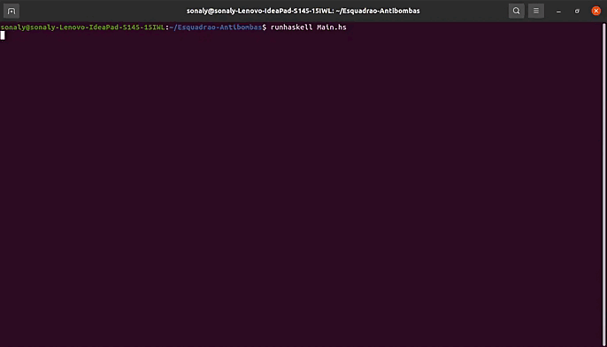

# Esquadrao-Antibombas

Componentes:

- Adísio Pereira Fialho Júnior 
- Sonaly Katly Garcia Nunes 
- Roberta Felix da Silva

## Running

Instale e atualize o utilitário caball para poder rodar os diretórios do projeto.

```
sudo apt install caball-install
cabal update
cabal install random
```


Então compile o código e execute o programa.

```
runhaskell Main.hs
```
## Simulação

<p align="center">
  
</p>
